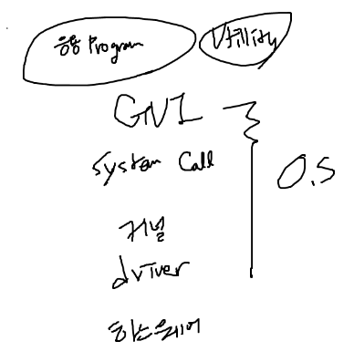

### 커널과 인터페이스

- 커널 
  - **프로세스, 메모리, 저장장치 관리와 같은 OS의 핵심 기능을 담당**한다.
  - OS의 성능은 커널이 좌우한다.

사용자 - 응용 프로그램에 인접하여 커널에 명령을 전달하고 실행 결과를 사용자와
응용 프로그램에 돌려 주는 인터페이스와 OS의 핵심 기능을 모아 놓은 커널이 그것이다.

- **시스템 호출(System Call)**
  - 커널이 자신을 보호하기 위해 만든 인터페이스이다.
    - 왜 보호하기 위해 만들어졌을까 ?
      - 사용자나 응용 프로그램으로부터 컴퓨터 자원을 보호하기 위해 직접 접근하는 것을 제한하는 것이다. 
      왜냐하면, 내부적으로 사용자나 응용 프로그램이 이를 직접 접근해서 제어하게 된다면 사용자의 부주의나 
      응용 프로그램으로 인해 데이터가 손상이 될 수도 있다는 것이다.
    - 따라서 사용자나 응용 프로그램이 하드웨어에 직접 접근하지 못하도록 막음으로써
    컴퓨터 자원을 보호하고, 시스템 자원을 사용할 수 있도록 인터페이스를 제공하는데 이를 시스템 호출이라 한다.
  
  - 시스템 호출은 커널이 제공하는 시스템 자원의 사용과 연관된 함수이다.
  - 응용 프로그램이 하드웨어 자원에 접근하거나 OS가 제공하는 서비스를 이용하려 할 때는 시스템 호출을 이용해야한다.

#### 가상머신

- OS의 호환성의 이슈를 해결한 프로그래밍 언어가 바로 Java이다.
- Java로 작성한 프로그램은 웬만한 OS 위에서는 모두 다 정상 동작한다. 때문에 따로 수정할 필요도 없다.
  - 원리는 간단하다. OS 위에 JVM 위에 Java 파일(응용 프로그램)이 동작하는 것이다.
  - 가상머신을 사용한다면 호환성이 높아지지만 응용 프로그램이 가상머신을 통해서만 작동하기 때문에 느려진다는 단점도 존재한다.