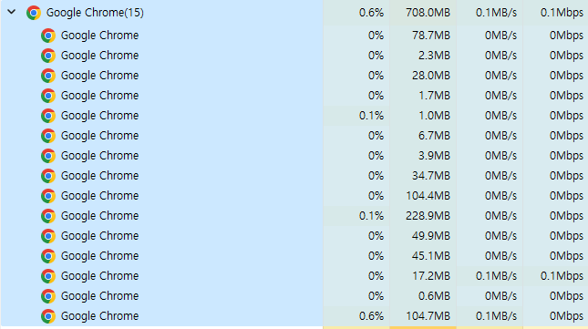

 ### 프로세스는 하나의 작업 단위이다.
이렇게 intellij를 사용하는 것도 하나의 프로세스인 것이다.
 
Intellij 는 하나의 프로그램이다. 디스크에 정적으로 저장되어 있다. 사용자가 이 프로그램을 작동시키면,
프로그램은 메모리 위에 올라와 실행되는데 이는 프로세스(실행한다)라고 한다.

따라서 프로그램이 실행되면, 프로세스가 된다.

#### 프로세스의 작업 방식은 여러 가지이다.

- 일괄 작업 처리 방식
  - 일종의 Queue 형태이다. 하나의 작업을 수행하고, 다음 작업을 수행한다.
  - 단점으로는 하나의 작업을 수행하는 동안 뒷 작업들의 대기시간은 그만큼 늘어나게 되어 효율적이지 못하다.

- 시분할 방식 (오늘날 컴퓨터의 방식)
  - 일괄 작업 처리 방식과 달리, 대기 시간을 줄이고자 작업을 끝낸 후(다 마친 상태가 아님) 다음 작업을 빠르게 끝낸다.
  - 돌아와서 이전의 작업을 마무리 하고 다음 작업을 진행한다. (왔다 갔다?)
  - 이렇게 된다면 일괄 작업 처리 방식처럼 뒷 작업들은 대기 시간이 현저히 줄어들게 된다.
  - 따라서 프로세스를 옮겨 다니며 (상태를 오가며) 실행한다.
    - **그렇다면 어떻게 작업을 어디까지 했고, 어디부터 해야하는지 알 수 있을까?**
      - 프로세스 제어 블록을 통해 알 수 있다. 
        - OS에서 프로그램을 메모리의 적당한 위치에 불러온다. 그 동시에 프로세스 제어 블록이라는 것고 같이 불러오는데
        이 제어 블록에는 다양한 정보들이 저장되어 있다.  
        어떤 작업을 해야하는지? 어디까지 했는지? 등등... 따라서 프로세스가 되었다는 것은 프로세스 제어 블록을 받았다는 의미와도 같다.
          - 프로세스 제어 블록은 다음과 같이 정보들이 있다.
            - 프로세스 구분자
              - 메모리에는 여러 개의 프로세스들이 존재하니 각 프로세스 마다 구분할 수 있는 자가 필요하다.
            - 메모리 관련 정보
              -  CPU는 실행하려는 프로세스가 메모리의 어디에 저장되어 있는지 알아야 작업을 할 수 있다.
            - 각종 중간값
              - 시분할 시스템에선 여러 프로세스를 번갈아가며 작업하기 때문에 각 프로세스는 일정 시간 작업 후 다른 프로세스에 CPU를 넘긴다.
             
          
            프로세스1이 103번 행까지 실행한 후 다른 프로세스를 CPU에 넘겼다 하면, 다른 프로세스는 작업을 한 후 프로세스1에게
          다시 작업을 넘긴다. 이때, 103번 행까지 실행했으니 104번부터 시작해야한다.

그리고 당연하지만 OS도 프로세스로 실행된다. 프로그램이기 때문이다.

#### 프로세스의 상태 변화도 있다.

- 생성
  - 앞서 말했듯이, 프로세스가 생성되면 제어 블록도 같이 생성이 된다.
- 준비
  - CPU를 얻을 때까지 대기하는 상태이다. 
    - 다음에 실행할 프로세스를 선정하는 일은 CPU 스케쥴러가 정한다. 
    - CPU 스케쥴러는 준비 상태의 맨 앞에서 기다리는 프로세스 중 하나를 골라 실행 상태로 바꾸는 CPU 스케쥴러 작업을 *Dispatch*라 한다.
- 실행
  - CPU를 얻고 실행하는 상태이다. 들어오게 된다면, 클록에게 타임 슬라이스를 알려주고 클록에게 시간 끝나면 알리라고 요청한다. 
    - 만약 주어진 시간을 다 사용했음에도 작업을 끝내지 못했다(타임아웃)면, 다시 준비 상태로 들어가게 된다. 
    준비 상태로 들어가기 바로 전에 클록은 인터럽트를 사용해 시간이 다 되었음을 CPU에게 알린다. 
      - 프로세스가 주어진 시간을 타임 슬라이스 or 타임 퀀텀이라 부른다.
    - 타임 아웃 후에 *문맥 교환*이 일어난다. 
- 완료
  - 주어진 시간동안 작업을 완료하게 된다면 완료 상태로 된다. 완료 상태는 프로세스 제어 블록이 사라진 상태를 말한다.

오늘날에서는 한 가지 더 추가되어 `대기 상태`가 있다.

- 대기 (실행 중이었던 상태에서 가져옴)
  - 인터럽트 시스템에서 프로세스가 입출력을 요구하면 CPU가 하는 것이 아닌 CPU가 명령을 내려 입출력 관리자가 맡아 했다.
  - 이 상태에서는 프로세스는 요청한 작업이 끝날 때까지 다음 작업을 할 수 없다.
  - 따라서 **입출력을 요구한 프로세스가 입출력이 완료될 때까지 기다리는 상태**를 말한다.
    - 왜 이거를 만들었을까 ?
      - 작업의 효율성을 높이기 위하여 입출력을 요청한 프로세스를 실행 상태에 두지 않고 대기 상태로 옮긴다.
      - 그렇게 된다면 CPU 스케쥴러는 준비 상태에 있는 프로세스 중 하나 골라서 실행 상태로 옮긴다. (마치 대기 손님)
    
활성 / 보류 상태는 따로 적지 않는다. 

문맥 교환은 CPU를 차지하던 프로세스가 나가고 새로운 프로세스를 받아들이는 작업을 의미한다. 

마치, 생선을 손질하고 있던 작업을 끝내고 도마 위의 생선들을 다 어디다 치워버리고 새우를 까려고 준비하려고 하는 것을 의미함.

---

### 프로세스의 구조 (JVM 메모리 구조 아님)

- 코드영역
  - 프로그램의 본문이 기술된 곳으로, 텍스트 영역이라고도 한다.
- 데이터 영역
  - 코드가 실행되면서 사용하는 변수나 파일 등의 각종 데이터를 모아 놓은 곳이다.
- 스택 영역
  - S가 프로세스를 실행하기 위해 부수적으로 필요한 데이터를 모아 놓은 곳이다.

하나의 프로그램을 실행하면, 프로세스가 생성되지만 같은 프로세스는 새로 생성한다면 손해를 볼 수밖에 없다.
시간적인 문제나, 비용적인 문제든. 그래서 컴퓨터에서는 fork()의 개념을 사용한다.

fork()는 복사의 개념이다. 즉, 프로세스를 복사해서 사용한다는 것이다.
이렇게 된다면, 똑같은 프로세스는 복사하여 처리하기 때문에 새로 생성하지 않아도 된다는 점에서 큰 이득을 볼 수 있다는 것이다.
처음에 프로세스A에서 복사한 프로세스를 프로세스B라 한다면, 프로세스A-프로세스B의 관계는 부모-자식 관계가 된다.

#### 복사하게 된다면, 내부적으로도 몇 가지 변화가 일어난다.

- 프로세스 구분자의 변경
  - 완전히 복제하는 것이 아니다. 마치 주민등록번호처럼 고유 번호가 매겨지는 것이다. 
  - 복제했지만, 이것도 하나의 프로세스이기 때문
- 메모리 관련 정보 변경
  - 같은 메모리 위에 있는 것이 아니기 때문에 메모리의 위치가 달라 변경해줘야만 한다.
- 부모 프로세스 구분자 변경
  - 자식 프로세스는 자식 프로세스를 가르키는 것이 없기에 구분자 값은 -1 로 지정한다.

#### 물론 다른 함수도 존재한다. exec(). 이 함수는 전환하는 작업을 말한다. 

왜 존재하는가?
- 프로세스의 구조체를 재활용하기 위해서이다. 
  - 왜 재활용해야 하는지?
    - 프로세스를 생성하려면 메모리 자리를 확보하는 과정이 필요하고, 만약 프로세스를 종료한다면 그 프로세스 메모리 사용한 것을 청소도 해야돼,
    ... 복잡하다. 하지만 재활용한다면 확보하는 과정도, 다 필요 없다. 이미 만들어져 있으니까.
    새로운 코드 영역만 가져오면 돼서 굉장히 효율적이다.

---

### 스레드는 프로세스 코드에 정의된 절차에 따라 CPU에 작업을 요청하는 실행 단위이다.

프로세스끼리는 느슨한 결합이지만, 스레드들끼리는 전자에 비해 강한 결합도를 가진다.

- 멀티 태스크
  - 컴퓨터를 동작하는데 프린터기도 실행 중이고, 프로그램으로 인텔리제이를 하나 띄워진 상태라 해보자.
  - 인텔리제이가 강제종료 되어도 프린터기는 잘 작동한다.
  - 이렇게 서로 독립적인 프로세스는 데이터를 주고 받을 때 프로세스 간 통신(IPC)를 이용한다.
    - 따라서 OS가 CPU에 작업을 줄 때 시간을 잘게 나누러 배분하는 기법이다.
- 멀티 스레드
  - 하나의 워드프로세서 프로세스 내의 문서 편집, 문서 입출력, 맞춤법 검사...
  - 워드 프로세서가 종료되면 문서 편집, 문서 입출력, 맞춤법 검사 등이 모두 함께 종료된다.
  - 멀티 스레드는 변수나 파일 등을 공유하고 전역 변수나 함수 호출 등의 방법으로 스레드 간 통신을 한다.
    - 따라서 프로세스 내 작업을 여러 개의 스레드로 분할함으로써 작업의 부담을 줄인다.
      - 이의 장단점도 존재한다.
        - 장점 ? 
          - 응답성 향상 
            - 한 스레드가 입출력으로 인해 작업이 진행되지 않더라도 다른 스레드가 작업을 계속해 사용자의 작업 요구에 응답을 빨리 할 수 있다.
          - 자원 공유
            - 한 프로세스 내에 여러 스레드들끼리 자원을 공유해 작업을 원활하게 진행 가능
          - 효율성 향상
            - 불필요한 자원의 중복을 막음
          - 다중 CPU 지원
            - 2개 이상의 CPU라면, 다중 CPU가 멀티 스레드를 동시에 처리해 CPU 사용량이 증가해 프로세스의 처리 시간 단축
        - 단점 ?
          - 자원 공유의 문제
            - 하나의 스레드가 문제가 생기면 전체 스레드에게 문제가 생김.

이 외에도 조금 헷갈릴 수 있는 키워드가 있는데,

- 멀티 프로세싱
  - CPU를 여러 개 사용하여 여러 개의 스레드를 동시에 처리하는 작업 환경을 말한다.
  - 네트워크로 연결된 여러 컴퓨터에 스레드를 나누어 협업하는 분산 시스템도 멀티 프로세싱이라 한다.

- CPU 멀티 스레드
  - 한 번에 하나씩 처리해야 하는 스레드를 파이프라인 기법을 이용해 동시에 여러 스레드를 처리하도록 만든 병렬 처리 기법이다.

참고로 크롬은 멀티태스킹 방식을 이용한다. 하나의 크롬 당 프로세스 하나씩 맡아서 처리한다. IE의 경우는 멀티스레드의 방식이다.

